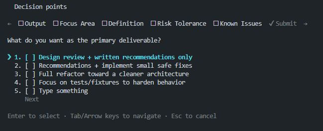

<p align="center"><code>npm i -g codex-rh</code><br />

<p align="center"><strong>Codex-rh</strong> is an OpenAI Codex CLI fork that runs locally on your computer, introducing plan-mode and other features like async subagents.
</br>

<p align="center">
  
  </p>

---

## Quickstart

### Installing and running Codex CLI

Install globally with your preferred package manager. If you use npm:

```shell
npm install -g @openai/codex-rh
```

Then simply run `codex` to get started:

```shell
codex-rh
```

---

## License

This repository is licensed under the [Apache-2.0 License](LICENSE).
